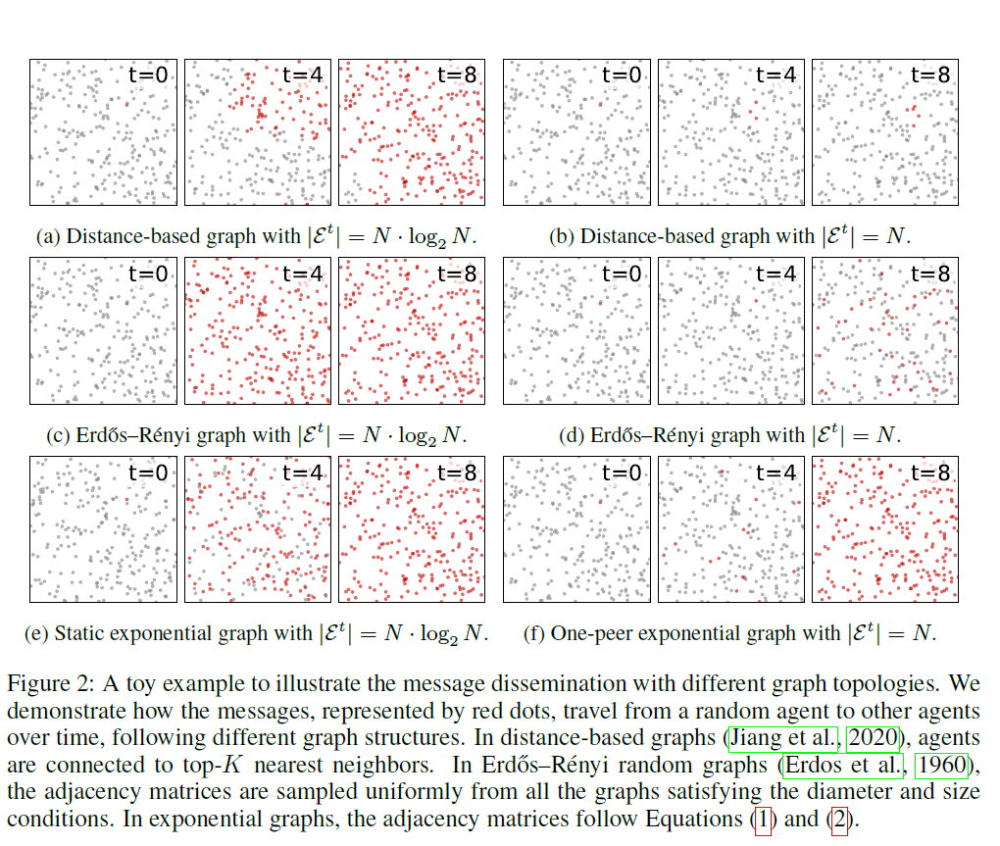
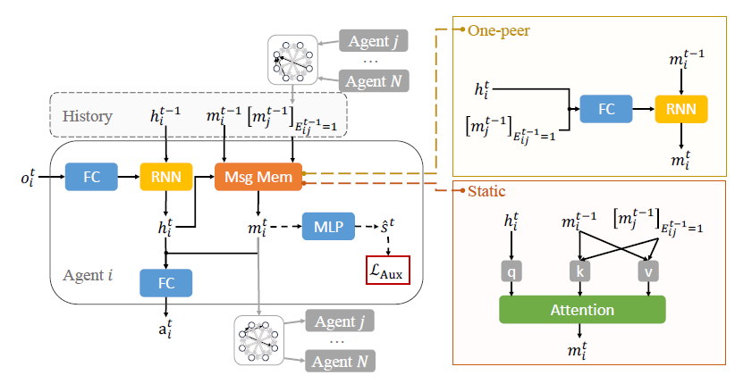

## Exponential Topology-Enabled Scalable Communication in Multi-Agent Reinforcement Learning

[Paper Link](https://openreview.net/pdf?id=CL3U0GxFRD) -- ICLR 2025

### 预备知识：指数图 (Exponential Graph)

#### 静态指数图 (Static Exponential Graph)

**连接规则**: 假设有 $n$ 个节点（编号为 $0 , 1 , ... , n - 1$），节点 $i$ 的邻居集合定义为：
$$N_i = \{ (i + 2^k) \bmod n \mid k = 0, 1, 2, ... , \lceil \log_2(n) \rceil - 1 \}$$

**优势**: 静态指数图是强连通的。通信成本为每个节点 $log_2(n)$(边的数量)。

#### 单对等指数图 (One Peer Exponential Graph)

- 连接规则与静态指数图相同，只是将静态指数图中的 $log_2(n)$ 条边分解为 $log_2(n)$ 个时间步。
- 在第 $t$ 时间步，节点 $i$ 只与邻居 $(i + 2^t) \bmod n$ 和 $(i - 2^t) \bmod n$ 进行通信。
- 经过 $log_2(n)$ 个时间步，所有节点之间的通信都完成。

**优势**: 在保证强连通性的前提下, 在每个时间步, 每个节点只需要与两个邻居进行通信, 因此通信成本为每个智能体 $\mathcal{O}(1)$。(时间换空间)

### 研究背景

- 在大量智能体(Many Agents) 的场景下，通信成本是一个重要的限制因素。随着智能体数量的增加， 通信成本会显著增加。例如在CommNet的全连接通信中， 每个智能体需要与所有其他智能体进行通信， 通信成本为 $\mathcal{O}(n^2)$。

- 随着通信的智能体数量增加，消息的理解难度也会增加。即使已经有了一些比较好的聚合策略 (如图神经网络和注意力机制)， 仍会影响学习效率。

### 本文贡献

本文将指数图 (Exponential Graph) 应用到多智能体强化学习中， 提出了一个基于指数图的通信机制。

- 静态指数图通信

在任意时间步$t$, 每个智能体$i$都与其邻居通信，其中邻居编号为 $(i + 2^t) \bmod n$。

智能体得到所有邻居消息后，使用注意力机制聚合这些消息。

- 单对等指数图通信

在时间区间 $t \in [0, \log_2(n)]$ 内，每个智能体$i$只与其邻居 $(i + 2^t) \bmod n$ 进行通信，其中 $t$ 是当前时间步。

#### 不同拓扑结构下消息的传播速度

为了证明指数图可以在有限时间内完成一轮全部智能体通信，论文分析了不同拓扑结构下消息的传播速度。

#### 消息的生成 (辅助函数)
在知道全局状态的情况下，利用下面的辅助函数。
\[
\mathcal{L}_{\text{aux}}^{\text{pred}}(\theta, \phi) =
\mathbb{E}_{(s^t, o^t) \sim \mathcal{D}}
[(s^t - f(m_i^t; \phi))^2]
\]

否则利用对比学习的辅助函数。
\[
\mathcal{L}_{\text{cont}}^{\text{aux}}(\theta) = - \mathbb{E}_{i,j,t,t'}
[\log \frac{ \exp\!( g(m_i^t) \cdot g(m_j^t) / \tau )}{\sum_{m \in \mathcal{M}} \exp\!( g(m_i^t) \cdot g(m) / \tau )}]
\]

#### 算法框架图

